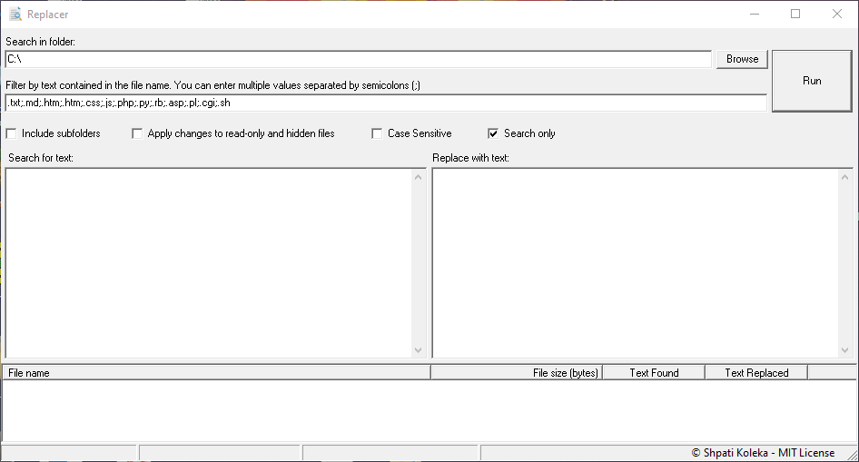

# Replacer
Replacer is a handy program for searching and replacing text any number of files within a user defined directory. 

Some of the program features are:

-	Can be used in Search only mode or Search & Replace mode.
-	Searching and Replacing recursively in the subfolders under the main selected folder.
-	Filtering of files with multiple values separated by semicolons. 
-	The program displays a list of files within the chosen folder, shows if the given text is contained in them as well as shows the status of the changes.
-	Supports replacing text within hidden or read-only files while preserving their file properties.
-	It's a free program (MIT license) so you can do whatever you want with the code. 

Please note that my Antivitus system from Microsoft all of a sudden decided to classify this program as a threat.
This is obviously a false positive so no need to worry :) 